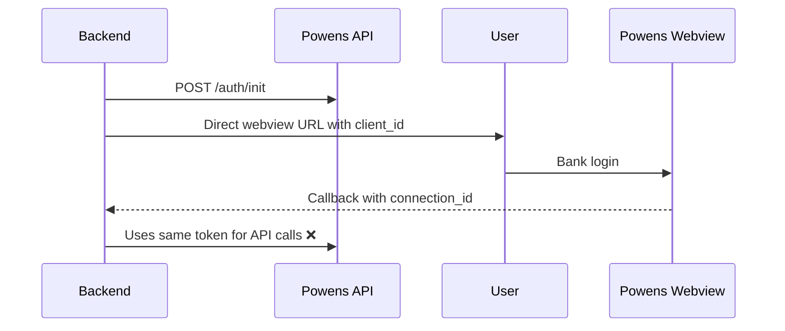
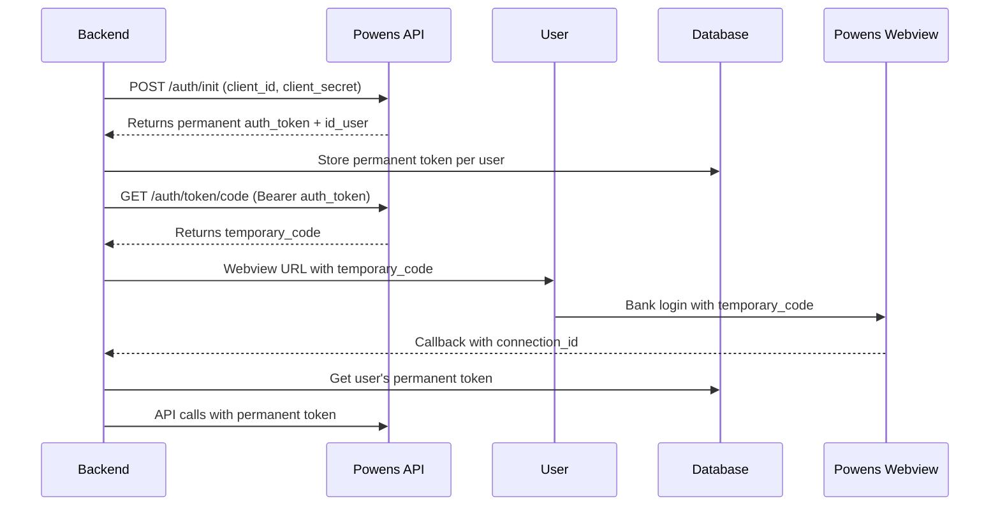

# POWENS AUTHENTICATION FLOW - COMPLETE IMPLEMENTATION

## 🎯 **WHAT WAS FIXED**

### **Critical Issues Resolved:**
1. ❌ **Missing `/api/sync/full` endpoint** - FIXED ✅
2. ❌ **Incorrect Powens authentication flow** - FIXED ✅  
3. ❌ **Single permanent token in .env for all users** - FIXED ✅
4. ❌ **Missing temporary code generation step** - FIXED ✅
5. ❌ **No user token management in database** - FIXED ✅

## 🔄 **NEW OFFICIAL POWENS AUTHENTICATION FLOW**

### **Before (Incorrect):**


### **After (Correct per Official Docs):**


## 🗄️ **DATABASE CHANGES**

### **New User Token Fields:**
```sql
ALTER TABLE users ADD COLUMN powens_user_id INTEGER;
ALTER TABLE users ADD COLUMN powens_permanent_token VARCHAR(500);
ALTER TABLE users ADD COLUMN powens_token_created_at TIMESTAMP;
ALTER TABLE users ADD COLUMN powens_token_expires_at TIMESTAMP;
ALTER TABLE users ADD COLUMN powens_token_type VARCHAR(50) DEFAULT 'temporary';
```

### **Enhanced Bank Connections:**
```sql
ALTER TABLE bank_connections ADD COLUMN token_source VARCHAR(50) DEFAULT 'oauth';
ALTER TABLE bank_connections ADD COLUMN powens_user_id_from_api INTEGER;
```

## 🔧 **ENVIRONMENT CONFIGURATION**

### **New .env Variables:**
```env
# Powens Token Configuration
USE_PERMANENT_TOKEN=true                    # Set to true for per-user permanent tokens
PERMANENT_ACCESS_TOKEN=                     # Legacy fallback (optional)

# Corrected URLs
POWENS_REDIRECT_URI=http://localhost:3000/api/auth/powens/callback
POWENS_DOMAIN=luxsy-sandbox
```

## 🚨 **CLEAR TOKEN LOGGING**

### **On Server Startup:**
```
🚨🚨🚨 POWENS SERVICE CONFIGURATION 🚨🚨🚨
🔑 Token Mode: 🔐 DATABASE PER-USER TOKENS
🌐 API URL: https://luxsy-sandbox.biapi.pro/2.0
🖥️  Webview URL: https://webview.powens.com/connect
🏢 Domain: luxsy-sandbox
📧 Client ID: ✅ SET
🔒 Client Secret: ✅ SET
🔗 Redirect URI: http://localhost:3000/api/auth/powens/callback
📦 Legacy Token: ❌ NOT SET
🚨🚨🚨🚨🚨🚨🚨🚨🚨🚨🚨🚨🚨🚨🚨🚨🚨🚨🚨
```

### **During Authentication Flow:**
```
🚀 STEP 1: Creating permanent user token
✅ PERMANENT TOKEN CREATED
🔄 STEP 2: Generating temporary code
✅ TEMPORARY CODE GENERATED
🔗 STEP 3: Generating webview URL
🎯 WEBVIEW URL GENERATED
📨 STEP 4: Processing callback
📊 CALLBACK DATA RETRIEVED
💾 SAVING CONNECTION DATA (NEW FLOW)
✅ CONNECTION SAVED (NEW FLOW)
```

## 🔍 **NEW DEBUG ENDPOINTS**

### **Database Debugging:**
- `GET /api/sync/debug/connections` - Check saved connections
- `GET /api/sync/debug/accounts` - Check saved accounts  
- `GET /api/sync/debug/transactions` - Check saved transactions

### **Token Debugging:**
- `GET /api/auth/powens/debug/user-token` - Check user's token status
- `POST /api/sync/debug/test-token` - Test token with live API calls

### **Missing Endpoint Fixed:**
- `POST /api/sync/full` - The endpoint your frontend was calling!

## 🎯 **HOW TO USE**

### **1. Run Database Migration:**
```bash
# Apply the new migration
psql -d fire_planning -f src/migrations/007_add_user_powens_tokens.sql
```

### **2. Update Environment:**
```env
USE_PERMANENT_TOKEN=true
POWENS_CLIENT_ID=your_client_id
POWENS_CLIENT_SECRET=your_client_secret
POWENS_REDIRECT_URI=http://localhost:3000/api/auth/powens/callback
```

### **3. Restart Server and Check Logs:**
Look for the prominent 🚨 configuration logging

### **4. Test the Flow:**
1. Connect to Powens (should see "NEW OFFICIAL FLOW" in success page)
2. Check debug endpoints to verify data was saved
3. Try "Full Sync" button (should now work!)

## 🧪 **DEBUGGING COMMANDS**

```bash
# Check if connections were saved
curl http://localhost:3000/api/sync/debug/connections

# Check if accounts were saved  
curl http://localhost:3000/api/sync/debug/accounts

# Check user's token status
curl http://localhost:3000/api/auth/powens/debug/user-token

# Test token with live API calls
curl -X POST http://localhost:3000/api/sync/debug/test-token

# Test the fixed Full Sync endpoint
curl -X POST http://localhost:3000/api/sync/full
```

## 🎉 **EXPECTED RESULTS**

### **Before Fix:**
- "Full Sync" returned 0 connections
- No bank data in database
- Incorrect authentication flow
- Single token for all users

### **After Fix:**
- "Full Sync" shows actual connections
- Bank accounts and transactions in database
- Official Powens authentication flow
- Per-user token management
- Clear debugging capabilities

## 🔄 **MIGRATION STRATEGY**

### **For Existing Users:**
1. Existing connections will continue to work
2. New connections will use the new flow
3. Tokens can be migrated to database gradually
4. Both flows supported during transition

### **Production Deployment:**
1. Run database migration
2. Update environment variables
3. Restart services
4. Monitor logs for new flow confirmation
5. Test with debug endpoints

## 🚨 **CRITICAL SUCCESS INDICATORS**

1. **Server logs show prominent 🚨 configuration**
2. **"Full Sync" returns > 0 connections**
3. **Debug endpoints show saved data**
4. **Success page shows "NEW OFFICIAL FLOW"**
5. **Bank accounts visible in dashboard**

The authentication flow now properly follows the official Powens documentation and supports per-user permanent tokens stored securely in the database!
